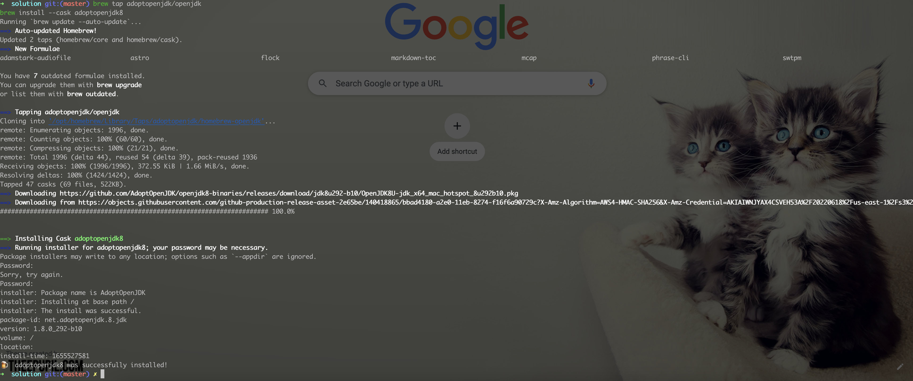
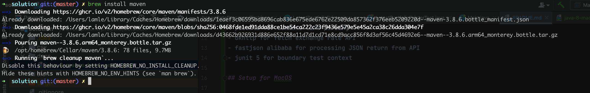
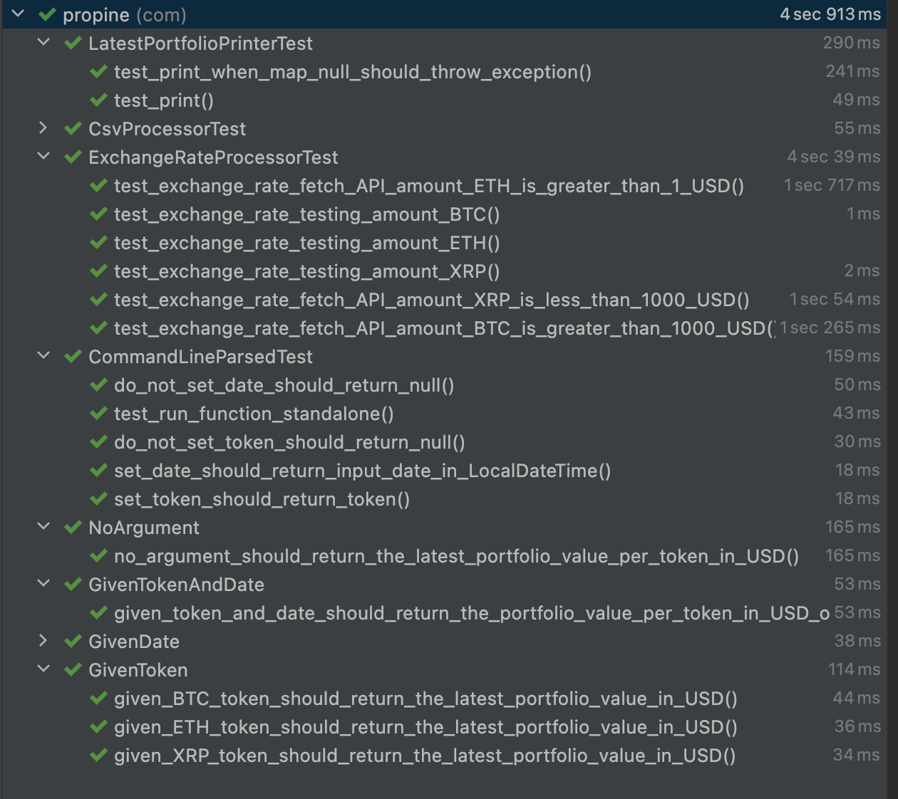
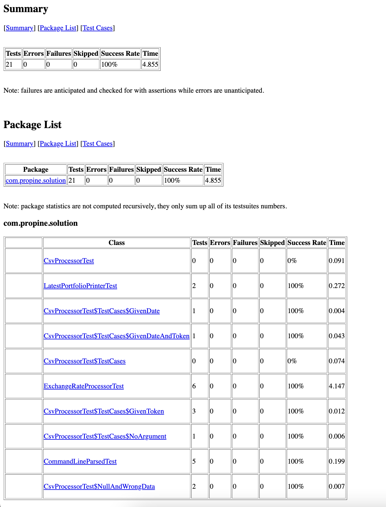
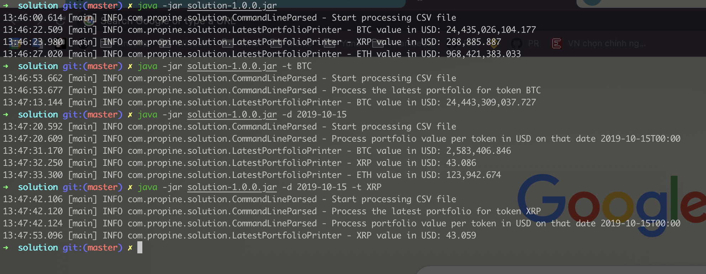

# Processing Huge Transactions CSV challenges

- csv/transactions.csv is small set data of given transactions.zip for running test cases
- please run intellij test with coverage and mvn clean surefire-report:report and then replacing the real transactions.csv
- we build fat jar file (application) without test for avoiding failing test cases

## Tech Stacks

- java 8
- maven 3
- intellij

### Sub libraries

- picocli for command line parsing
- okhttp for fetch exchange rate API
- fastjson alibaba for processing JSON return from API
- junit 5 for boundary test context

## Setup for MacOS

### Java 8

```
    brew tap adoptopenjdk/openjdk
    brew install --cask adoptopenjdk8
```



### Maven 3.8.6

```
    brew install maven
```




## Build fat jar file

```shell

    mvn clean install -DskipTests

```

## Move fat jar file to root folder/directory

```shell

    mv target/solution-1.0.0.jar .
    
```

# Run jar file with arguments - default CSV file path at ./csv/transactions.csv 
### We do not have option for changing CSV file path in our challenge


```shell
    
    # no argument
    java -jar solution-1.0.0.jar 

    # given token
    java -jar solution-1.0.0.jar -t BTC
    
    # given date
    java -jar solution-1.0.0.jar -d 2019-10-25
    
    # given token & date
    java -jar solution-1.0.0.jar -t BTC -d 2019-10-25
    
    # with testing exchange rate
    # BTC USD is 30_000
    # ETH USD is 1_000
    # XRP USD is 0.3
    java -jar solution-1.0.0.jar -test 
    
```

## Run test cases by Intellij

- Right click on src/test/java -> More Run/Debug -> Run 'All Tests' with Coverage




## Run test by Commandline

```shell

    mvn clean test
    
    mvn clean surefire-report:report

```

- Please refer  ./docs/surefire-report.html




# Final Result

